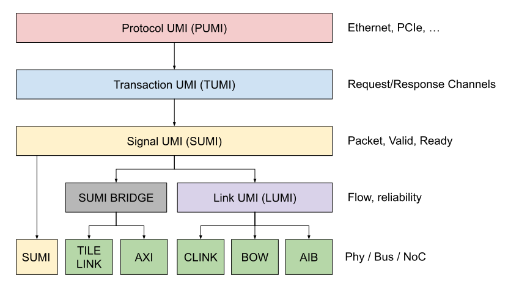
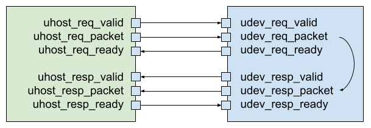
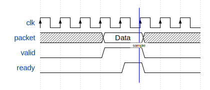
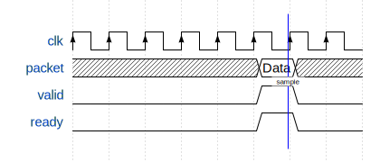
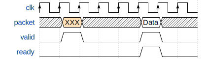
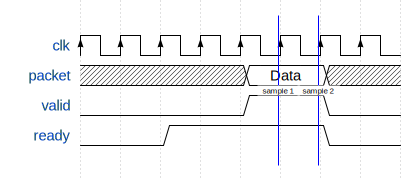
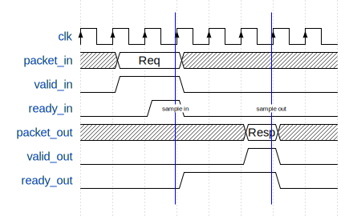

# Universal Memory Interface (UMI)

## 1. Introduction

### 1.1 Architecture:

The Universal Memory Interface (UMI) is a stack of standardized abstractions for reading and writing memory, with the core principle being that "everything is an address". UMI includes four distinct layers:

* **Application**: Protocol/application specific packets (Ethernet, PCIe, ...)
* **Transaction**: Address based read/write transactions
* **Link**: Communication integrity (flow control, reliability)
* **Physical**: Electrical signaling (pins, wires, etc.)




### 1.2 Key features:

  * tiered abstraction memory model 
  * separate request and response channels
  * 64b/32b addressing support
  * bursting of up to 256 transfers
  * data sizes up to 1024 bits per transfer
  * atomic transactions
  * error detection and correction
  * user reserved opcodes
  * compatible with existing bus interfaces
  * extendible
  * design for high bandwidth and low latency

### 1.3 Terminology:

| Word   | Meaning                                  |
|--------|------------------------------------------|
| Host   | Initiates a request                      |
| Device | Responds to a request                    |
| SA     | Source address                           |
| DA     | Destination address                      |
| DATA   | Data packet                              |
| CMD    | Transaction command                      |
| SIZE   | Data size per individual transfer        |
| LEN    | Number of individual transfers           |
| EDAC   | Error detect/correction control          |
| PRIV   | Privilege mode                           |
| EOF    | End of frame indicator                   |
| EXT    | Extended command option                  |
| USER   | User command bits                        |
| ERR    | Error code                               |

## 1. Protocol Layer

Higher level protocols (such as ethernet) can be layered on top of a 
UMI transactions by packing headers and payloads appropriately based on the protocol. Data packing is little endian, with the header starting in byte 0 of the transaction data field. Protocol header and payload data is transparent to the UMI 
transaction layer except at the end point.

| Protocol | Payload(Data) |Header(Data)|Source Addr|Dest Addr| Command |
|:--------:|:-------------:|:----------:|:---------:|:-------:|:-------:|
| Ethernet | 64B - 1,518B  |14B         | 8B        | 8B      | 4B      |
| CXL-68   | 64B           |2B          | 8B        | 8B      | 4B      |
| CXL-256  | 254B          |2B          | 8B        | 8B      | 4B      |

## 2. Transaction Layer

### 2.1 Transaction Architecture

The UMI transaction layer defines an memory architecture with the following architectural constraints:

 * Separate channels for requests and responses
 * Requests are initiated by hosts
 * Responses are returned by devices
 * Per-channel point-to-point transaction ordering
 * Bursts must not cross 4KB address boundaries
 * Addresses must be aligned to SIZE
 * Payload data is little-endian aligned

A summary of all UMI request types are shown below.

| CMD           |DATA|SA|DA|31 |30:20|19:18|17:16|15:8|7:4     |3:0|
|---------------|:--:|--|--|---|:---:|-----|-----|----|:------:|---|
|INVALID		    |    |  |  |-- | --  |--   |--   |--  |0x0     |0x0|
|REQ_RD         |    |Y |Y |EXT| USER|EDAC |PRIV |LEN |EOF,SIZE|0x1|
|REQ_WR         |Y	 |Y |Y |EXT| USER|EDAC |PRIV |LEN |EOF,SIZE|0x3|
|REQ_WRPOSTED   |Y   |  |Y |EXT| USER|EDAC |PRIV |LEN |EOF,SIZE|0x5|
|REQ_RDMA	      |    |Y |Y |EXT| USER|EDAC |PRIV |LEN |EOF,SIZE|0x7|
|REQ_ATOMICADD  |Y	 |Y |Y |EXT| USER|EDAC |PRIV |0x00|1,SIZE  |0x9|
|REQ_ATOMICAND  |Y	 |Y |Y |EXT| USER|EDAC |PRIV |0x01|1,SIZE  |0x9|
|REQ_ATOMICOR   |Y	 |Y |Y |EXT| USER|EDAC |PRIV |0x02|1,SIZE  |0x9|
|REQ_ATOMICXOR  |Y	 |Y |Y |EXT| USER|EDAC |PRIV |0x03|1,SIZE  |0x9|
|REQ_ATOMICMAX  |Y	 |Y |Y |EXT| USER|EDAC |PRIV |0x04|1,SIZE  |0x9|
|REQ_ATOMICMIN  |Y	 |Y |Y |EXT| USER|EDAC |PRIV |0x05|1,SIZE  |0x9|
|REQ_ATOMICMAXU |Y	 |Y |Y |EXT| USER|EDAC |PRIV |0x06|1,SIZE  |0x9|
|REQ_ATOMICMINU |Y	 |Y |Y |EXT| USER|EDAC |PRIV |0x07|1,SIZE  |0x9|
|REQ_ATOMICSWAP |Y	 |Y |Y |EXT| USER|EDAC |PRIV |0x08|1,SIZE  |0x9|
|REQ_MULTICAST  |Y	 |Y |Y |EXT| USER|EDAC |PRIV |LEN |EOF,SIZE|0xB|
|REQ_ERROR      |Y	 |Y |Y |EXT| USER|EDAC |PRIV |ERR |0,0x0   |0xD|
|REQ_LINK       |    |	|	 |EXT| --  |--   |--   |--  |-,0x1   |0xD|
|REQ_RESERVED   |Y	 |Y |Y |EXT| USER|EDAC |PRIV |LEN |0,SIZE  |0xF|

A summary of all UMI response types are shown below.

| CMD           |DATA|SA|DA|31 |30:20|19:18|17:16|15:8|7:4     |3:0|
|---------------|:--:|--|--|---|:---:|-----|-----|----|:------:|---|
| RESP_READ	    |Y	 |Y	|Y |EXT|USER |EDAC |PRIV |LEN |EOF,SIZE|0x2|
| RESP_READANON |Y   |  |Y |EXT|USER |EDAC |PRIV |LEN |EOF,SIZE|0x4|
| RESP_WRITE    |	   |Y	|Y |EXT|USER |EDAC |PRIV |LEN |EOF,SIZE|0x6|
| RESP_WRITEANON|Y	 |  |Y |EXT|USER |EDAC |PRIV |LEN |EOF,SIZE|0x8|
| RESP_ERROR    |Y 	 |Y |Y |EXT|USER |EDAC |PRIV |ERR |0, 0x0  |0xA|
| RESP_LINK     |	   |	|	 |-- |--   |--   |--   |--  |0, 0x1  |0xA|
| RESP_RESERVED |Y   |Y |Y |EXT|USER |EDAC |PRIV |LEN |EOF,SIZE|0xC|
| RESP_RESERVED |Y   |  |Y |EXT|USER |EDAC |PRIV |LEN |EOF,SIZE|0xE|

### 2.1 Burst Length (LEN[7:0])

A transaction starts with a host driving control information and the address of the first byte involved. The LEN field field defines the number of data transfers (beats) to be completed in sequence. Each one of the data transfers is the size defined by the SIZE field. The LEN field is 8 bits wide, supporting 1 to 256 transfers(beats) per transaction.

The address of a transfer number 'i' in a burst of length LEN is defined by:

ADDR_i = START_ADDR + (i-1) * 2^SIZE. 

### 2.2 Transfer Size (SIZE[2:0])

The SIZE field defines the number of bytes in each data transfer (beat) in a transaction. THe transfer size must not exceed the data bus width of the host or device involved in the transaction. 

|SIZE[2:0] |Bytes per transfer|
|:--------:|:----------------:|
| 0b000	   | 1 
| 0b001    | 2                 
| 0b010    | 4
| 0b100    | 8
| 0b101    | 16
| 0b110    | 32
| 0b111    | 128

### 2.3 End of Frame (EOF)

The EOF transaction field indicates that the current transaction is the last in a sequence of related UMI transactions. Single-transaction requests and responses must set the EOF bit to 1. Use of the EOF bit at the end-point
is optional and implementation specific. The EOF can be used as a hardware interrupt or as a bit in memory to be queried by software or hardware.

### 2.4 Privilege Mode (PRIV[1:0])

The PRIV transaction field indicates the privilege level of the transaction, 
following the RISC-V architecture convention. The information enables
control access to memory at an end point based on privilege mode.   

|PRIV[1:0]| Level | Name      |  
|:-------:|:-----:|-----------|
| 0b00	  | 0     | User      |
| 0b01    | 1     | Supervisor|                  
| 0b10    | 2     | Hypervisor|
| 0b11    | 3     | Machine   |

### 2.5 Error Detection and Correction (EDAC[1:0])

The EDAC transaction field controls how data errors should be detected and 
corrected. Availability of the different EDAC modes and the implementation
of each mode is implementation specific. 

|EDAC[1:0]| Operation |  
|:-------:|-----------|
| 0b00	  | No error detection or correction. Assumes a reliable channel
| 0b01    | Detect errors and respond with an error code on failure
| 0b10    | Detect errors and retry transaction on failure  
| 0b11    | Forward error correction 

### 2.6 User Field (USER[10:0])

The USER field can be used by an application or protocol to tunnel
information to the physical layer or as hints and directions to the endpoint.

This field will likely be reduced as more essential command features are
developed.

### 2.7 Command Extension (EXT)

The EXT field enables expanding the types of transactions and options
available by leveraging the lower bits of the data and source address fields.
The EXT command can be used to support complex non-UMI protocols that may 
require a large number features (such as cache coherent protocols). Bits
39:0 of the source address bits can be used for control information when
EXT = 1. The EXT mode is not available for transactions that do not require
a source address field or in implementations that require all 64 bits of
the source field for operation.

## 4. Signal Layer

### 4.1 Interface

The native UMI signaling layer consists of a packet, valid signal,
ready signal with the following naming convention:

```
u<host|dev>_<req|resp>_<packet|ready|valid>
```

Connections shall only be made between hosts and devices,
per the diagram below.




Components in a system can have a UMI host port, device port, or both.

```verilog

// HOST VERILOG
output        uhost_req_valid;
output[255:0] uhost_req_packet;
input         uhost_req_ready;
input         uhost_resp_valid;
input[255:0]  uhost_resp_packet;
output        uhost_resp_ready;

// DEVICE VERILOG
input         udev_req_valid;
input[255:0]  udev_req_packet;
output        udev_req_ready;
output        udev_resp_valid;
output[255:0] udev_resp_packet;
input         udev_resp_ready;
```

### 3.2 Handshake Protocol


UMI adheres to the following ready/valid handshake protocol:
1. A transaction occurs on every rising clock edge in which READY and VALID are both asserted.
2. Once VALID is asserted, it must not be de-asserted until a transaction completes.
3. READY, on the other hand, may be de-asserted before a transaction completes.
3. The assertion of VALID must not depend on the assertion of READY.  In other words, it is not legal for the VALID assertion to wait for the READY assertion.
4. However, it is legal for the READY assertion to be dependent on the VALID assertion (as long as this dependence is not combinational).

#### Legal: VALID asserted before READY



#### Legal: READY asserted before VALID


#### Legal: READY and VALID asserted simultaneously



#### Legal: READY toggles with no effect


#### **ILLEGAL**: VALID de-asserted without waiting for READY



#### Legal: VALID asserted for multiple cycles

In this case, multiple transactions occur.



#### Example Bidirectional Transaction


