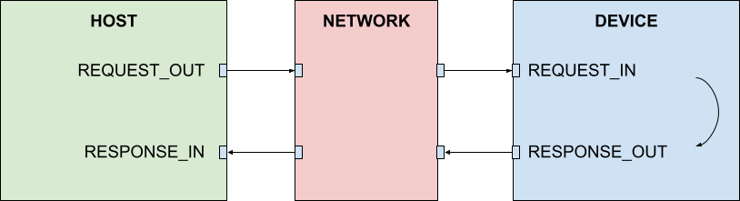
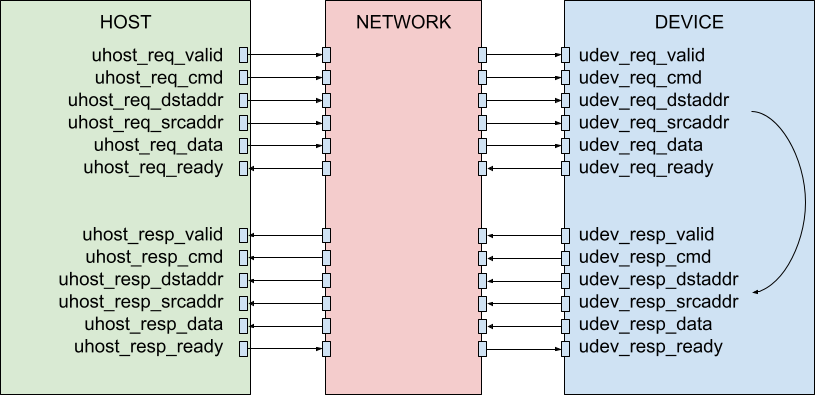

# Universal Memory Interface (UMI)

## 1. Introduction

### 1.1 Architecture

The Universal Memory Interface (UMI) is a transaction based standard for accessing memory through request-response message exchange patterns. UMI includes five distinct abstraction layers:

* **Protocol**: Protocol/application specific payload (Ethernet, PCIe)
* **Transaction**: Address based request-response messaging
* **Signal**: Latency insensitive signaling (packet, ready, valid)
* **Link**: Communication integrity (flow control, reliability)
* **Physical**: Electrical signaling (electrons, wires, etc.)


### 1.2 Key Features

  * independent request and response channels
  * word sizes up to 1024 bits
  * up to 256 word transfers per transaction
  * atomic transaction support
  * quality of service support
  * protection and security support
  * reserved opcodes for users and future expansion

### 1.3 Key Terms

* **Transaction**: Complete request-response memory operation.
* **Message**: Unidirectional request or response, consisting of a command header, address fields, and an optional data payload.
* **Host**: Initiator of memory requests.
* **Device**: Responder to memory requests.

----
## 2. Protocol UMI (PUMI) Layer

UMI transaction payloads are treated as a series of opaque bytes and can carry arbitrary data, including higher level protocols. The maximum data size available for communication protocol data and headers is 32,768 bytes. The following table illustrates recommended bit packing for a number of common communication standards.

| Protocol  | Payload(UMI DATA) | Header(UMI Data)|UMI Addresses + Command |
|:---------:|:-----------------:|:---------------:|:----------------------:|
| Ethernet  | 64B - 1,518B      |14B              | 20B                    |
| CXL-68    | 64B               |2B               | 20B                    |
| CXL-256   | 254B              |2B               | 20B                    |

----
## 3. Transaction UMI (TUMI) Layer

### 3.1 Theory of Operation

UMI transactions are request-response memory exchanges between Hosts and Devices. Hosts send memory access requests to devices and get responses back.  The figure below illustrates the relationship between hosts, devices, and the interconnect network.



Basic UMI read/write transaction involves the transfer of LEN+1 words of data of width 2^SIZE bytes between a device and a host.

**Summary:**
* UMI transaction type, word size (SIZE), transfer count (LEN), and other options are encoded in a 32bit transaction command header (CMD).
* Device memory access is communicated through a destination address (DA) field.
* The host source address is communicated through the source address (SA) field.
* The destination address indicates the memory address of the first byte in the transaction.
* Memory is accessed in increasing address order starting with DA and ending with DA + (LEN+1)\*(2^SIZE)-1.
* The maximum data field size is 32,768 bytes.

**Hosts:**

* Send read, write memory access request messages
* Validate and execute incoming responses
* Identify egress interface through which to send requests (in case of multiple)

**Devices:**

* Validate and execute incoming memory request messages
* Initiate response messages when required
* Identify egress interface through which to send responses (in case of multiple)

**Constraints:**
* Device and source addresses must be aligned to the native word size.
* Requests with the same HOSTID arrive at the target device in the same order that they left the host.
* Responses with the same HOSTID return to the host in the same order that they left the device.

### 3.2 Message Format

#### 3.2.1 Message Fields

| Term        | Meaning    |
|-------------|------------|
| CMD         | Command (type + options)
| DA          | Destination address of message
| SA          | Source address (where to return a response)
| DATA        | Data payload
| OPCODE      | Command opcode
| SIZE        | Word size
| LEN         | Word transfers per message
| QOS         | Quality of service required
| PROT        | Protection mode
| EX          | Exclusive access indicator
| EOF         | End of frame indicator
| EOM         | End of message indicator
| U           | User defined message bit
| R           | Reserved message bit
| ERR         | Error code
| HOSTID      | Host ID
| DEVID       | Device ID
| MSB         | Most significant bit

#### 3.2.2 Message Byte Order

Request and response messages are packed together in the following order:

|                  |MSB-1:160|159:96|95:32|31:0|
|------------------|:-------:|:----:|:---:|:--:|
| 64b architecture |DATA     |SA    |DA   | CMD|
| 32b architecture |DATA     |DATA  |SA,DA| CMD|

#### 3.2.3 Message Types

The table below documents all UMI message types. CMD[4:0] is the UMI opcode defining the type of message being sent. CMD[31:5] are used for message specific options. Complete functional descriptions of each message can be found in the [Message Description Section](#34-transaction-descriptions).

|Message     |DATA|SA|DA|31:27 |26:25|24:22     |21:20|19:16|15:8 |7:5 |4:0  |
|------------|:--:|--|--|:----:|:---:|:--------:|:---:|-----|-----|----|-----|
|INVALID     |    |  |  |--    |--   |--        |--   |--   |--   |0x0 |0,0x0|
|REQ_RD      |    |Y |Y |HOSTID|U    |EX,EOF,EOM|PROT |QOS  |LEN  |SIZE|R,0x1|
|REQ_WR      |Y   |Y |Y |HOSTID|U    |EX,EOF,EOM|PROT |QOS  |LEN  |SIZE|R,0x3|
|REQ_WRPOSTED|Y   |Y |Y |HOSTID|U    |0 ,EOF,EOM|PROT |QOS  |LEN  |SIZE|R,0x5|
|REQ_RDMA    |    |Y |Y |HOSTID|U    |0 ,EOF,EOM|PROT |QOS  |LEN  |SIZE|R,0x7|
|REQ_ATOMIC  |Y   |Y |Y |HOSTID|U    |0 ,EOF,EOM|PROT |QOS  |ATYPE|SIZE|R,0x9|
|REQ_USER0   |Y   |Y |Y |HOSTID|U    |EX,EOF,EOM|PROT |QOS  |LEN  |SIZE|R,0xB|
|REQ_FUTURE0 |Y   |Y |Y |HOSTID|U    |EX,EOF,EOM|PROT |QOS  |LEN  |SIZE|R,0xD|
|REQ_ERROR   |    |Y |Y |HOSTID|U    |U         |U    |U    |U    |0x0 |R,0xF|
|REQ_LINK    |    |  |  |U     |U    |U         |U    |U    |U    |0x1 |R,0xF|
|RESP_RD     |Y   |  |Y |HOSTID|ERR  |EX,EOF,EOM|PROT |QOS  |LEN  |SIZE|R,0x2|
|RESP_WR     |    |  |Y |HOSTID|ERR  |EX,EOF,EOM|PROT |QOS  |LEN  |SIZE|R,0x4|
|RESP_USER0  |    |  |Y |HOSTID|ERR  |EX,EOF,EOM|PROT |QOS  |LEN  |SIZE|R,0x6|
|RESP_USER1  |Y   |  |Y |HOSTID|ERR  |EX,EOF,EOM|PROT |QOS  |LEN  |SIZE|R,0x8|
|RESP_FUTURE0|    |  |Y |HOSTID|ERR  |EX,EOF,EOM|PROT |QOS  |LEN  |SIZE|R,0xA|
|RESP_FUTURE1|Y   |  |Y |HOSTID|ERR  |EX,EOF,EOM|PROT |QOS  |LEN  |SIZE|R,0xC|
|RESP_LINK   |    |  |  |U     |U    |U         |U    |U    |U    |0x0 |R,0xE|

### 3.3 Message Fields

### 3.3.1 Source Address and Destination Address (SA[63:0], DA[63:0])

The destination address (DA) specifies the target address of a request or response message. For requests, the DA field is the full device address to access. For responses, the DA field returned is a copy of the requester SA field.  The SA field can be a full address (32/64 bits) or a partial routing address and a set of optional [UMI signal layer](#UMI-Signal-layer) controls needed to drive the interconnect network.

Responses do not have the SA field.  At the SUMI level, while the SA bus is always present, its value is undefined in response packets.  Implementations must not depend on the value of the SA bus in response packets.

The table below shows the bit mapping for SA field.

| SA       |63:56 |55:48|47:40|39:32|31:24 |23:16|15:8|7:0  |
|----------|:----:|:---:|:---:|:---:|:----:|:---:|:---|:---:|
| 64b mode |R     | R   | R   | U   | U    | U   |U   |U    |
| 32b mode | --   | --  | --  | --  | R    | U   |U   |U    |

### 3.3.2 Transaction Word Size (SIZE[2:0])

The SIZE field defines the number of bytes in a transaction word. Devices are not required to support all SIZE options. Hosts must only send messages with a SIZE supported by the target device.

|SIZE[2:0] |Bytes per word|
|:--------:|:------------:|
| 0b000    | 1
| 0b001    | 2
| 0b010    | 4
| 0b011    | 8
| 0b100    | 16
| 0b101    | 32
| 0b110    | 64
| 0b111    | 128

### 3.3.3 Transaction Length (LEN[7:0])

The LEN field defines the number of words of size 2^SIZE bytes transferred by a transaction. The number of transfers is equal to LEN + 1, equating to a range of 1-256 transfers per transaction. The current address of transfer number 'i' in a transaction is defined by:

ADDR_i = START_ADDR + (i-1) * 2^SIZE.

### 3.3.4 Protection Mode (PROT[1:0])

The PROT field indicates the protected access level of the transaction, enabling controlled access to memory.

|PROT[Bit] | Value | Function            |
|:--------:|:-----:|---------------------|
| [0]      | 0     | Unprivileged access |
|          | 1     | Privileged access   |
| [1]      | 0     | Secure access       |
|          | 1     | Non-secure access   |

### 3.3.5 Quality of Service (QOS[3:0])

The QOS field controls the quality of service required from the interconnect network. The interpretation of the QOS bits is interconnect network specific.

### 3.3.6 End of Message (EOM)

The EOM bit is reserved for UMI signal layer and is used to track the transfer of the last word in a message.

### 3.3.7 End of Frame (EOF)

The EOF bit can be used to indicate the last message in a sequence of related UMI transactions. Use of the EOF bit at an endpoint is optional and implementation specific.

### 3.3.8 Exclusive Access (EX)

The EX field is used to indicate exclusive access to an address. The function is used to enable atomic load-store exchanges. The sequence of operation:

1. Host sends a REQ_RD to address A (with EX=1) with HOSTID B
2. Host sends a REQ_WR to address A (with EX=1) With HOSTID B
3. Device:
   1. If address A has NOT been modified by another host since last exclusive read, device writes to address A and returns a ERR = 0b01 in RESP_WR to host.
   2. If address A has been modified by another host since last exclusive read, device returns a ERR = 0b00 in RESP_WR to host and does not write to address A.

### 3.3.9 Error Code (ERR[1:0])

The ERR field indicates the error status of a response (RESP_WR, RESP_RD) transaction.

|ERR[1:0]| Meaning                            |
|:------:|------------------------------------|
| 0b00   | OK (no error)                      |
| 0b01   | EXOK (successful exclusive access) |
| 0b10   | DEVERR (device error)              |
| 0b11   | NETERR (network error)             |

DEVERR trigger examples:

* Insufficient privilege level for access
* Write attempted to read-only location
* Unsupported word size
* Access attempt to disabled function

NETERR trigger examples:

* Device address unreachable
* Packet cannot be routed due to data bus width narrowing

### 3.3.9 Atomic Transaction Type (ATYPE[7:0])

The ATYPE field indicates the type of the atomic transaction.

|ATYPE[7:0]| Meaning     |
|:--------:|-------------|
| 0x00     | Atomic add  |
| 0x01     | Atomic and  |
| 0x02     | Atomic or   |
| 0x03     | Atomic xor  |
| 0x04     | Atomic max  |
| 0x05     | Atomic min  |
| 0x06     | Atomic maxu |
| 0x07     | Atomic minu |
| 0x08     | Atomic swap |

### 3.3.10 Host ID (HOSTID[4:0])

The HOSTID field indicates the ID of the host making a transaction request. All transactions with the same ID value must remain in order.

### 3.3.11 User Field (U)

Message bit designated with a U are available for use by application and signal layer implementations. Any undefined user bits shall be set to zero.

### 3.3.12 Reserved Field (R)

Message bit designated with an R are  reserved for future UMI enhancements and shall be set to zero.

## 3.4 Message Descriptions

### 3.4.1 INVALID

INVALID indicates an invalid message. A receiver can choose to ignore the message or to take corrective action.

### 3.4.2 REQ_RD

REQ_RD reads (2^SIZE)*(LEN+1) bytes from device address(DA). The device initiates a RESP_RD message to return data to the host source address (SA).

If at some point in the network REQ_RD is determined to be unroutable (for example, at a network boundary), RESP_RD should be sent back to the SA of the request with ERR=NETERR with no data (DATA=0 at the SUMI level, empty array at the TUMI level).  All other fields in RESP_RD (SIZE, LEN, etc.) should match those in the request.

If REQ_RD cannot be executed by a device for any reason (including an unsupported SIZE), RESP_RD should be sent back to the SA of the request with ERR=DEVERR and no data; all other fields (SIZE, LEN, etc.) should match those in the request.

### 3.4.3 REQ_WR

REQ_WR writes (2^SIZE)*(LEN+1) bytes to destination address(DA). The device then initiates a RESP_WR acknowledgment message to the host source address (SA).

If REQ_WR cannot be transmitted past a certain point in the network due to a narrowing in the data bus width, RESP_WR should be sent back to the SA of the request with ERR=NETERR; all other fields (SIZE, LEN, etc.) should match those in the request.  The same behavior applies when REQ_WR is unroutable.

If REQ_WR cannot be executed by a device for any reason (including an unsupported SIZE), RESP_WR should be sent back to the SA of the request with ERR=DEVERR; all other fields (SIZE, LEN, etc.) should match those in the request.

### 3.4.4 REQ_WRPOSTED

REQ_WRPOSTED performs a unidirectional posted-write of (2^SIZE)*(LEN+1) bytes to destination address (DA).  There is no response message sent by the device back to the host.

If the destination address is reachable and SIZE is supported at the destination and the entire path leading to it, the REQ_WRPOSTED message is guaranteed to complete, otherwise it may fail silently.  This means that REQ_WRPOSTED may be dropped silently if it cannot pass through part of the network due to data bus narrowing, if the transaction is determined to be unroutable at some point along its path (e.g., at a network boundary), or if the request is unsupported by a device.

### 3.4.5 REQ_RDMA

REQ_RDMA reads (2^SIZE)\*(LEN+1) bytes of data from a primary device destination address (DA) along with a source address (SA). The primary device then initiates a REQ_WRPOSTED message to write (2^SIZE)\*(LEN+1) data bytes to the address (SA) in a secondary device. REQ_RDMA requires the complete SA field for addressing and does not support pass through information for the UMI signal layer.

REQ_RDMA may be dropped silently if it is determined to be unroutable, or if the request is unsupported by the primary device.

### 3.4.6 REQ_ATOMIC{ADD,OR,XOR,MAX,MIN,MAXU,MINU,SWAP}

REQ_ATOMIC initiates an atomic read-modify-write memory operation of size (2^SIZE) at destination address (DA). The REQ_ATOMIC sequence involves:

1. Host sending data (DATA), destination address (DA), and source address (SA) to the device,
2. Device reading data address DA
3. Applying a binary operator {ADD,OR,XOR,MAX,MIN,MAXU,MINU,SWAP} between D and the original device data
4. Writing the result back to device address DA
5. Returning the original device data to host address SA with a RESP_RD message.

If REQ_ATOMIC cannot be transmitted past a certain point in the network due to a narrowing in the data bus width, RESP_RD should be sent back to the SA of the request with ERR=NETERR and no data; all other fields (SIZE, LEN, etc.) should match those in the request.  The same behavior applies when REQ_ATOMIC is unroutable.

If REQ_ATOMIC cannot be executed by a device for any reason (including an unsupported SIZE), RESP_RD should be sent back to the SA of the request with ERR=DEVERR and no data; all other fields (SIZE, LEN, etc.) should match those in the request.

### 3.4.7 REQ_ERROR

REQ_ERROR sends a unidirectional message to a device (ERR) to indicate that an error has occurred. The device can choose to ignore the message or to take action. There is no response message sent back to the host from the device.

### 3.4.8 REQ_LINK

RESP_LINK is a reserved CMD only message for link layer non-memory mapped actions such as credit updates, time stamps, and framing. CMD[31-8] are all available as user specified control bits. The message is local to the signal (physical) layer and does not include routing information and does not elicit a response from the receiver.

### 3.4.9 REQ_USER

REQ_USER message types are reserved for non-standardized custom UMI messages.

### 3.4.10 REQ_FUTURE

REQ_FUTURE message types are reserved for future UMI feature enhancements.

### 3.4.11 RESP_RD

RESP_RD returns (2^SIZE)*(LEN+1) bytes of data to the host source address (SA) specified by the REQ_RD message.

If RESP_RD cannot be transmitted past a certain point in the network due to a narrowing in the data bus width, then the transaction should be modified so that ERR=NETERR, and the DATA field should be dropped (DATA=0 at the SUMI level, empty array at the TUMI level).  All other fields (SIZE, LEN, etc.) should be unmodified.

RESP_RD may be dropped silently in the network if it is determined to be unroutable.

### 3.4.12 RESP_WR

RESP_WR returns an acknowledgment to the original source address (SA) specified by the the REQ_WR transaction. The message does not include any DATA.

RESP_WR may be dropped silently in the network if it is determined to be unroutable.

### 3.4.13 RESP_LINK

RESP_LINK is a reserved CMD only transaction for link layer non-memory mapped actions such as credit updates, time stamps, and framing. CMD[31-8] are all available as user specified control bits. The transaction is local to the signal (physical) layer and does not include routing information.

### 3.4.14 RESP_USER

RESP_USER message types are reserved for non-standardized custom UMI messages.

### 3.4.15 RESP_FUTURE

RESP_FUTURE message types are reserved for future UMI feature enhancements.

----
## 4. Signal UMI Layer (SUMI)

### 4.1 Theory of Operation

The UMI signal layer (SUMI) defines the mapping of UMI transactions to a
point-to-point, latency insensitive, parallel, synchronous interface with a [valid ready handshake protocol](#32-handshake-protocol).



The SUMI signaling layer defines a subset of TUMI information to be transmitted as an  atomic packet. The follow table documents the legal set of SUMI packet parameters .

| Field    | Width (bits)       |
|:--------:|--------------------|
| CMD      | 32                 |
| DA       | 32, 64             |
| SA       | 32, 64             |
| DATA     | 64,128,256,512,1024|

The following example illustrates a complete request-response transaction between a host and a device.


UMI messages can be split into multiple atomic SUMI packets as long as message ordering and byte ordering is preserved. A SUMI packet is a complete routable mini-message comprised of a CMD, DA, SA, and DATA field, with DA and SA fields updated to reflect the correct byte addresses of the DATA payload. The end of message (EOM) bit indicates the arrival of the last packet in a message.

The following examples illlustrate splitting of UMI read and write messages into shorter SUMI packets.

TUMI read example:

* TUMI_REQ_RD  (SIZE=0, LEN=71, DA=200, SA=100)
* TUMI_RESP_RD (SIZE=0, LEN=71, DA=100, DATA=...)

Potential SUMI packet sequence:

* SUMI_REQ_RD  (SIZE=0, LEN=71, DA=200, SA=100, EOM=1)
* SUMI_RESP_RD (SIZE=0, LEN=12, DA=100, DATA=..., EOM=0)
* SUMI_RESP_RD (SIZE=0, LEN=23, DA=113, DATA=..., EOM=0)
* SUMI_RESP_RD (SIZE=0, LEN=34, DA=137, DATA=..., EOM=1)

TUMI write example:

* TUMI_REQ_WR  (SIZE=0, LEN=71, DA=200, SA=100, DATA...)
* TUMI_RESP_WR (SIZE=0, LEN=71, DA=100)

Potential SUMI packet sequence:

* SUMI_REQ_WR  (SIZE=0, LEN=12, DA=200, SA=100, DATA=..., EOM=0)
* SUMI_REQ_WR  (SIZE=0, LEN=23, DA=213, SA=113, DATA=..., EOM=0)
* SUMI_REQ_WR  (SIZE=0, LEN=34, DA=237, SA=137, DATA=..., EOM=1)
* SUMI_RESP_WR (SIZE=0, LEN=12, DA=100, EOM=0)
* SUMI_RESP_WR (SIZE=0, LEN=23, DA=113, EOM=0)
* SUMI_RESP_WR (SIZE=0, LEN=34, DA=137, EOM=1)

Note that SA and DA increment in the sequence of transactions resulting from a split request.  In a split response, only DA increments in the resulting transactions, because responses don't have the SA field.  Please be aware of this incrementing behavior when storing user information in SA or DA, since incrementing could modify that information.  Formally, bit *n* in an address is safe from modification if the original outbound transaction satisfies:

A\[n-1:0\] + (2^SIZE)*(LEN+1) < 2^n

If A\[n-1:0\]=0, this reduces to the requirement that the number of bytes in the transaction is less than 2^n.  As a simple example, consider A\[1:0\]=0b00, SIZE=0.  Bit A\[2\] is safe from modification if LEN=0, 1, or 2 but not if LEN=3.  If A\[1:0\] is instead 0b10, bit A\[2\] is only safe when LEN=0.

### 4.1.1 Splitting Rules

Generalizing from the example above, this section describes the formal rules for splitting a SUMI packet.

Definitions:
1. The number of split outputs is denoted *N*.
2. A field of the *i*th split output is referred to as FIELD_out\[i\], with 0<=i<=N-1.
3. The notation FIELD_out\[p:q\] means the values FIELD_out\[p\] through (inclusive) FIELD_out\[q\].
4. The notation FIELD_in means the value of FIELD in the SUMI packet being split.

Rules:
1. Splitting is allowed only for REQ_RD, REQ_WR, REQ_WRPOSTED, REQ_RDMA, RESP_RD, RESP_WR, when EX=0.
2. Copy HOSTID, ERR, EOF, PROT, QOS, SIZE, OPCODE, and any USER or RESERVED fields into each split output.
3. LEN_out\[i\] may be different for each split output as long as sum(LEN_out[0:N-1])+N == LEN_in+1.
4. DA_out\[i\] := DA_out\[i-1\] + (2^SIZE)*(LEN_out\[i-1\]+1), 1<=i<=(N-1).  DA_out\[0\] := DA_in.
5. SA_out\[i\] := SA_out\[i-1\] + (2^SIZE)*(LEN_out\[i-1\]+1), 1<=i<=(N-1).  SA_out\[0\] := SA_in.  Applies only to split requests, because reponses do not have the SA field.
6. EOM_out\[i\] := EOM_in & (i == (N-1)).

### 4.1.2 Merging Rules

Merging, the inverse of splitting, is also permitted for related SUMI packets.  This may be done to improve packet transmission performance by reducing network bandwidth required.  This may also improve host or device performance: for example, a device may be able to deal with related requests more efficiently if they have been merged together into a single SUMI packet.  Similarly, a host may be able to process merged responses more effectively.  This section describes the formal rules for merging SUMI packets.

Definitions:
1. The number of merge inputs is denoted *N*.
2. A field of the *i*th merge input is referred to as FIELD_in\[i\], with 0<=i<=N-1.
3. The notation FIELD_in\[p:q\] means the values FIELD_in\[p\] through (inclusive) FIELD_in\[q\]
4. The notation FIELD_out means the value of FIELD in the output of a SUMI packet merge.

Rules:
1. Merging is allowed only for REQ_RD, REQ_WR, REQ_WRPOSTED, REQ_RDMA, RESP_RD, RESP_WR, when EX=0.
2. HOSTID, ERR, EOF, PROT, QOS, SIZE, OPCODE, and any USER or RESERVED fields must match in all merge inputs.  These values are copied into the merge output.
3. EOM_in\[i\] must be 0 for 0<=i<=(N-2), that is, it must be zero for all but the last merge input.  EOM_in\[N-1\] may be either 0 or 1.
4. DA_in\[i\] must be equal to DA_in\[i-1\] + (2^SIZE)*(LEN_in\[i-1\]+1), 1<=i<=(N-1).
5. DA_out := DA_in\[0\].
6. SA_in\[i\] must be equal to SA_in\[i-1\] + (2^SIZE)*(LEN_in\[i-1\]+1), 1<=i<=(N-1).  Applies only to merged requests.
7. SA_out := SA_in\[0\].  Applies only to merged requests.
8. LEN_out := sum(LEN_in\[0:N-1\])+N-1.
9. EOM_out := EOM_in\[N-1\].

### 4.2 Handshake Protocol

SUMI adheres to the following ready/valid handshake protocol:


1. A transaction occurs on every rising clock edge in which READY and VALID are both asserted.
2. Once VALID is asserted, it must not be de-asserted until a transaction completes.
3. READY, on the other hand, may be de-asserted before a transaction completes.
4. The assertion of VALID must not depend on the assertion of READY.  In other words, it is not legal for the VALID assertion to wait for the READY assertion.
5. However, it is legal for the READY assertion to be dependent on the VALID assertion (as long as this dependence is not combinational).

The following examples help illustrate the handhsake protocol.

#### LEGAL: VALID asserted before READY


#### LEGAL: READY asserted before VALID


#### LEGAL: READY and VALID asserted simultaneously


#### LEGAL: READY toggles with no effect


#### LEGAL: VALID asserted for multiple cycles (multiple transactions)


#### **ILLEGAL**: VALID de-asserted without waiting for READY


### 4.3 Verilog Standard Interfaces

#### 4.3.1 Host Interface

```verilog
output          uhost_req_valid;
input           uhost_req_ready;
output [CW-1:0] uhost_req_cmd;
output [AW-1:0] uhost_req_dstaddr;
output [AW-1:0] uhost_req_srcaddr;
output [DW-1:0] uhost_req_data;

input           uhost_resp_valid;
output          uhost_resp_ready;
input [CW-1:0]  uhost_resp_cmd;
input [AW-1:0]  uhost_resp_dstaddr;
input [AW-1:0]  uhost_resp_srcaddr;
input [DW-1:0]  uhost_resp_data;
```
#### 4.3.1 Device Interface

```verilog
input           udev_req_valid;
output          udev_req_ready;
input [CW-1:0]  udev_req_cmd;
input [AW-1:0]  udev_req_dstaddr;
input [AW-1:0]  udev_req_srcaddr;
input [DW-1:0]  udev_req_data;

output          udev_resp_valid;
input           udev_resp_ready;
output [CW-1:0] udev_resp_cmd;
output [AW-1:0] udev_resp_dstaddr;
output [AW-1:0] udev_resp_srcaddr;
output [DW-1:0] udev_resp_data;
```

## 5. UMI Link Layer (LUMI)

UMI link layer interface converts the parallel SUMI interface into packetized, framed interface. The packets over LUMI will be sent by sending cmd, dstaddr, srcaddr and data on the same lines.

### 5.1 Signals

The following table provides the LUMI interface signals presented from a device side perspective. All signals are single ended and unidirectional. All unidirectional signals must be deterministically driven at all
times.

| SIGNAL        | DRIVER | DESCRIPTION                           |
| ------------- | ------ | ------------------------------------- |
| nreset        | host   | Asynchronous active low reset         |
| clk           | host   | LUMI clock                            |
| rxctrl[3:0]   | host   | RX link control signals(eg. valid,..) |
| rxstatus[3:0] | device | RX link status signals(optional)      |
| rxdata[N-1:0] | host   | RX link data signals                  |
| txctrl[3:0]   | device | TX link control signals(eg. valid,..) |
| txstatus[3:0] | host   | TX link status signals(optional)      |
| txdata[N-1:0] | device | TX link data signals                  |

LUMI supports data width of 8, 16, 32, 64 and 128 bits.

The following diagram show how a host and device is connected over LUMI.


### 5.2 Signal Description

#### nreset

Asynchronous active low reset. To prevent power up and initialization issues the device 'nreset' pin must be sampled by a synchronizer with asynchronous assert and synchronous deassert logic.
[REF](https://github.com/siliconcompiler/lambdalib/blob/main/stdlib/rtl/la_rsync.v)

#### clk

Data link clock driven by host (phase1/pos).

#### txctrl[0]/rxctrl[0]

Valid signal for the Rx (host -> device) or Tx (device -> host) packet. A HIGH value indicates valid data and valid data is transmitted on every cycle with valid high.
Unlike UMI SUMI layer LUMI does not require a ready signal in order to transmit data. The interface uses credit flow control as described in section 5.4 below.
This signal is mandatory in all implementations.

#### txctrl[1]/rxctrl[1]

Optional signal indicating burst trafic. When high this signal indicates that the current packet is continous to the previous one and therefore does not carry the header. It can only be asserted when the packet is continous to the previous one and has the same SUMI header.

#### txctrl[2]/rxctrl[2]

Optional forward error correction (fec) signal to handle soft errors in rxdata.

#### txctrl[3]/rxctrl[3]

Optional redundancy "aux" signal to handle manufacturing errors or persistent in the field error of one of the rxdata pins.

#### txstat[3:0]/rxstat[3:0]

Optional status indications.

#### txdata[N-1:0]/rxdata[N-1:0]

LUMI egress/ingress data bus, active high. Supports 8b, 16b, and 64b modes. The data width is identical between the host and device and needs to be negotiated before the link can be used.

### 5.3 Protocol

The LUMI standard requires the host to fully support UMI protocol.

* [Universal Memory Interface (UMI)](https://github.com/zeroasiccorp/umi)

LUMI packet format follows the UMI one and serializes the UMI cmd, dstaddr, srcaddr and data fields into one serial bit stream.

| [511:0] | [63:0]  | [63:0]  | [31:0] |
| ------- | ------- | ------- | ------ |
| data    | srcaddr | dstaddr | cmd    |

LUMI packets are transmitted over the Tx/Rx pins with reduces interface size and are sent LSB first.
The following example shows packet transmittion over 64b interface:

| Cycle | 63:32    | 31:0       |
| ----- | -------- | ---------- |
| 1     | A[31:0]  | C[31:0]    |
| 2     | S[31:0]  | A[63:32]   |
| 3     | D[31:0]  | S[63:32]   |
| 4     | D[95:64] | D[63:32]   |
| ...   |          |            |
| 11    | NA       | D[511:480] |

The following features are implemented in order to optimize the link efficiency:

* Command (C), Address (A) and Source Address (S) fields will only be transmitted where they are meaningful, per UMI spec.
  e.g. - data will not be sent on read commands

* Data fields will only be sent up to the packet size, e.g, - even if SUMI data width is 64B clink will only transmit the bytes up to the specific message length

* Packet burst (optional) - when ctrl[1] pin is being used lumi can merge continous packets.

### 5.4 Flow control

LUMI is using credit based flow control. The credit init/update messages will be sent over the link using LUMI link-layer commands and are controlled by the reciever side. The transmitter side of each link is responsible for not exceeding published credits. If the transmitter does exceed published credits, subsequent behavior of the receiver is undefined.
Credit update messages are using command only in order to reduce the overhead.

Credit init/update messages will be sent using link-layer UMI command:

| Message       | [31:16] data | [15:12] addr                           | [11:8] LNK CMD    | [7:0] UMI CMD  |
| ------------- | ------------ | -------------------------------------- | ----------------- | -------------- |
| Invalid       | NA           | NA                                     | 0x0 invalid       | link layer CMD |
| credit init   | #credit      | 0x0 - req credit<br/>0x1 - resp credit | 0x1 credit init   | link layer CMD |
| credit update | #credit      | 0x0 - req credit<br/>0x1 - resp credit | 0x2 credit update | link layer CMD |

The credit are in CLINK data width units. One credit represents a single data cycle with valid high.

### 5.5 Credit/link initialization

After reset both sides of the link wake up in non-active state and can only accept credit-init transactions. Once a credit init message is received the transmitter may start sending packets up to the provided credit.

### 5.6 Physical layer mapping

UMI link layer can be transported over several physical layer options.
The following options are supported and their mapping outlined below:

* CLINK physical layer as defined in CLINK spec
* Bunch of Wires (BoW)
* Advanced Interface Bus (AIB)
* Universal Chiplet Interconnect Express (UCIe)

#### 5.6.1 Bunch of Wires mapping
LUMI over BoW will use BoW physical layer only. BoW physical layer does not have any framing to the data and therefore requires sending LUMI valid signal over a data lane.
The signal mapping is the following:

| BoW signal   | CLINK signal   | Description                          |
| ------------ | -------------- | ------------------------------------ |
| TX Data      | txdata + txvld | Data to transmit over BoW            |
| RX Data      | rxdata + rxvld | Data received over BoW               |
| Core clk     | clk[0]         | CLINK clock to be used as BoW clock  |

Other, optional, signals like FEC and AUX will not be used by LUMI.

#### 5.6.2 AIB mapping

AIB uses a simple, no framing data structure. When transporting LUMI over AIB the LUMI interface will connect to the AIB MAC interface.
The signal mapping for AIB MAC is the following:

| AIB signal   | CLINK signal | Description                          |
| ------------ | ------------ | ------------------------------------ |
| data_out     | txdata       | Data to transmit over AIB            |
| data_in      | rxdata       | Data received over AIB               |
| m_ns_fwd_clk | clk[0]       | CLINK clock to be used as AIB clock  |
| m_fw_fwd_clk | ------       | CLINK does not use Rx clock          |
| ns_mac_rdy   | txctrl[0]    | Valid signal for TX data             |
| fs_mac_rdy   | rxctrl[0]    | Valid signal for RX data             |

Other optional AIB Plus signals are not required for LUMI-AIB connection and will not be used.

#### 5.6.3 UCIe mapping

LUMI over UCIe will use UCIe Raw Die-to-Die interface (RDI).
The signal mapping for RDI is the following:

| UCIe signal    | CLINK signal | Description                          |
| -------------- | ------------ | ------------------------------------ |
| lclk           | clk[0]       | clock                                |
| lp_irdy        | txctrl[0]    | data ready signal - same as valid    |
| lp_valid       | txctrl[0]    | data valid indication                |
| lp_data        | txdata       | data to be transmitted               |
| lp_retimer_crd | ------       | Not used (for retimer only)          |
| pl_trdy        | ------       | Not used (FC handled at CLINK level) |
| pl_valid       | rxctrl[0]    | data valid from phy                  |
| pl_data        | rxdata       | data from phy                        |
| pl_retimer_crd | ------       | Not used (for retimer only)          |

UCIe also requires implementing other phy control logic to maintain the link. The following signals will be handled by the UCIe<->CLINK bridge and not exposed to the CLINK. They should handled and set before the link is declaered active.

- lp_state_req
- lp_linkerror
- pl_state_sts
- pl_inband_pres
- pl_error
- pl_cerror
- pl_nferror
- pl_trainerror
- pl_phyinrecenter
- pl_stallreq

## Appendix A: UMI Transaction Translation

### A.1 RISC-V

UMI transactions map naturally to RISC-V load store instructions. Extra information fields not provided by the RISC-V ISA (such as as QOS and PRIV) would need to be hard-coded or driven from CSRs.

| RISC-V Instruction   | DATA | SA       | DA | CMD         |
|:--------------------:|------|----------|----|-------------|
| LD RD, offset(RS1)   | --   | addr(RD) | RS1| REQ_RD      |
| SD RD, offset(RS1)   | RD   | addr(RD) | RS1| REQ_WR      |
| AMOADD.D rd,rs2,(rs1)| RD   | addr(RD) | RS1| REQ_ATOMADD |

The address(RD)refers to the ID or source address associated with the RD register in a RISC-V CPU. In a bus based architecture, this would generally be the host-id of the CPU.

### A.2 TileLink

### A.2.1 TileLink Overview

TileLink [[REF 1](#references)] is a chip-scale interconnect standard providing multiple masters (host) with coherent memory-mapped access to memory and other slave (device) devices.

Summary:

* provides a physically addressed, shared-memory system
* provides coherent access for an arbitrary mix of caching or non-caching masters
* has three conformance levels:
  * TL-UL: Uncached simple read/write operations of a single word (TL-UL)
  * TL-UH: Bursting read/write without support for coherent caches
  * TL-C: Complete cache coherency protocol
* has five separate channels
  * Channel A: Request messages sent to an address
  * Channel B: Request messages sent to a cached block (TL-C only)
  * Channel C: Response messages from a cached block (TL-C only)
  * Channel D: Response messages from an address
  * Channel E: Final handshake for cache block transfer (TL-C only)

### A.1.1 TileLink <-> UMI Mapping

This section outlines the recommended mapping between UMI transaction and the TileLink messages. Here, we only explore mapping TL/UH TileLink modes with UMI 64bit addressing and UMI bit mask support up to 128 bits.

| Symbol | Meaning                   | TileLink Name       |
|:------:|---------------------------|---------------------|
| C      | Data is corrupt           | {a,b,c,d,e}_corrupt |
| BMASK  | Mask (2^SIZE)/8 (strobe)  | {a,b,c,d,e}_mask    |
| HOSTID | Source ID                 | {a,b,c,d,e}_source  |

The following table shows the mapping between TileLink and UMI transactions, with TL-UL and TL-UH TileLink support. TL-C conformance is left for future development.

| TileLink Message| UMI Transaction |CMD[26:25]|
|-----------------|-----------------|----------|
| Get             | REQ_RD          | 0b00     |
| AccessAckData   | RESP_WR         | --       |
| PutFullData     | REQ_WR          | 0bC0     |
| PutPartialData  | REQ_WR          | 0bC0     |
| AccessAck       | RESP_WR         | --       |
| ArithmaticData  | REQ_ATOMIC      | 0b00     |
| LogicalData     | REQ_ATOMIC      | 0bC0     |
| Intent          | REQ_USER0       | 0b00     |
| HintAck         | RESP_USER0      | --       |

The TileLink has a single long N bit wide 'size' field, enabling 2^N to transfers per message. This is in contrast to UMI which has two fields: a SIZE field to indicate word size and a LEN field to indicate the number of words to be transferred. The number of bytes transferred by a UMI transaction is (2^SIZE)*(LEN+1).

The pseudo code below demonstrates one way of translating from the TileLink size and the UMI SIZE/LEN fields.

```c
if (tilelink_size<8){
   SIZE = tilelink_size;
   LEN = 0;
} else {
   SIZE = 7;
   LEN  = 2^(tilelink_size-8+1)-1
}
```
The TileLink master id and masking signals are mapped to the UMI SA field as shown in the table below.

| SA       |63:56 |55:48|47:40|39:32|31:24 |23:16|15:8 |7:0  |
|----------|:----:|:---:|:---:|:---:|:----:|:---:|:----|:---:|
| 64b mode |R     | R   | R   | U   | U    | U   |BMASK|BMASK|

The TileLink atomic operations encoded in the param field map to the UMI ATYPE field as follows.

| TileLink param |UMI ATYPE   |
|----------------|:----------:|
| MIN (0)        | ATOMICMIN  |
| MAX (1)        | ATOMICMAX  |
| MINU (2)       | ATOMICMINU |
| MAXU (3)       | ATOMICMAXU |
| XOR(0)         | ATOMICXOR  |
| OR  (1)        | ATOMICOR   |
| AND  (2)       | ATOMICAND  |
| SWAP  (3)      | ATOMICSWAP |

### A.2 AXI4

### A.2.1 AXI4 Overview

AXI is a transaction based memory access protocol with five independent channels:

* Write requests
* Write data
* Write response
* Read request
* Read data

Constraints:

* AXI transactions must not cross 4,096 Byte address boundaries
* The maximum transaction size is 4,096 Bytes

### A.2.2 AXI4 <-> UMI Mapping

The table below maps AXI terminology to UMI terminology.

| AXI             | UMI         |
|-----------------|-------------|
| Manager         | Host        |
| Subordinate     | Device      |
| Transaction     | Transaction |

The table below shows the mapping between the five AXI channels and UMI messages.

| AXI Channel     | UMI Message |
|-----------------|-------------|
| Write request   | REQ_WR      |
| Write data      | REQ_WR      |
| Write response  | RESP_WR     |
| Read request    | REQ_RD      |
| Read data       | RESP_RD     |

The AXI LEN, SIZE, ADDR, DATA, QOS, PROT[1:0], HOSTID, LOCK fields map directly to equivalent UMI CMD fields. See the tables below for mapping of other AXI signals to the SA fields:

 SA        |63:56 |55:48|47:40|39:32 |31:24   |23:16        |15:8|7:0 |
|----------|:----:|:---:|:---:|:----:|:------:|:-----------:|:--:|:--:|
| 64b mode |R     | R   | R   |U     |U,REGION|U,CACHE,BURST|STRB|STRB|
| 32b mode |--    | --  | --  | --   |R       |U,CACHE,BURST|STRB|STRB|

Restrictions:
 * PROT[2] is not supported.(set to 0)
 * Data width limited to 128 bits
 * HOSTID limited to 4 bits
 * REGION only supported in 64bit mode

### A.3 AXI Stream

### A.3.1 AXI Stream Overview

AXI-Stream is a point-to-point protocol, connecting a single Transmitter and a single Receiver.

### A.3.2 AXI Stream <-> UMI Mapping

The mapping between AXI stream and UMI is shown int he following tables.

| AXI             | SUMI signal|
|-----------------|------------|
| tvalid          | valid      |
| tready          | ready      |
| tdata           | DATA       |
| tlast           | EOF        |
| tid             | HOSTID     |
| tuser           | SA         |
| tkeep           | SA         |
| tstrb           | SA         |
| twakeup         | SA

 SA        |63:56 |55:48    |47:40|39:32|31:24 |23:16 |15:8 |7:0  |
|----------|:----:|:-------:|:---:|:---:|:----:|:----:|:---:|:---:|
| 64b mode |U     |U,TWAKEUP|TUSER|TDEST|TKEEP |TKEEP |TSTRB|TSTRB|
| 32b mode |--    | --      | --  | --  |TKEEP |TKEEP |TSTRB|TSTRB|

Restrictions:
 * Data width limited to 128 bits
 * TID limited to 4 bits
 * TDEST, TUSER, TWAKEUP only available in 64bit address mode.

----
## References

[1] [TileLink Specification (version 1.7)](https://static.dev.sifive.com/docs/tilelink/tilelink-spec-1.7-draft.pdf)

[2] [AMBA4 AXI Protocol Specification (22 February 2013, Version E)](https://developer.arm.com/documentation/ihi0022/e)

[3] [AMBA4 AXI Stream Protocol Specification (09 April 2021, Version A)](https://developer.arm.com/documentation/ihi0051/a)

[4] [AMBA4 APB Protocol Specification (13 April 2010, Version C)](https://developer.arm.com/documentation/ihi0024/c)
